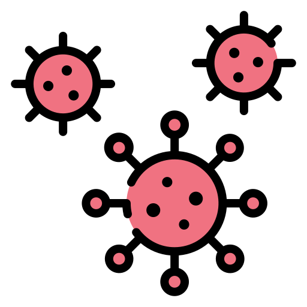

	

<h1 style="text-align:center;">CoWIN Vaccine Slots</h1>
<h3  style="text-align:center;"><a href="https://covid-vaccine-slots.netlify.app/">https://covid-vaccine-slots.netlify.app/</a></h3>

I created the website where you can check the Covid Vaccine Slots without login which is one of the most furstating part. Behind the scene I created the server where I access the official <a href="https://apisetu.gov.in/public/marketplace/api/cowin"> CoWIN APIs </a> and update my DB from their I am transferring it on Frontend website. 

  

**If you like my work, you can support me by buying me a coffee by clicking the link below**

